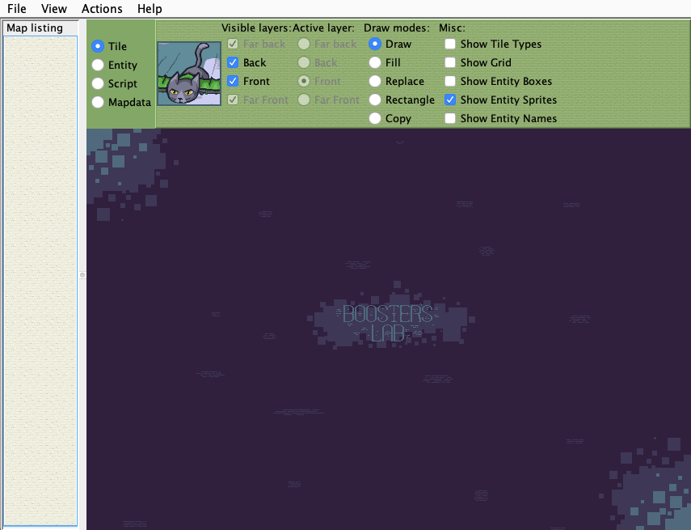

# Booster's Lab	

 > *"I'm pretty sure that, with this ... release [4.2.0], Booster's Lab is the definitive Cave Story editor now.
    There's really no reason to use any other editor for modding."* - GirakaCHEEZER
    

**Booster's Lab** is a Java-based cross-platform Cave Story editor created by **Noxid**. Currently, it is the most recommended editor due to its stability, range of features and multi-engine compatibility.

[Download](https://github.com/autumn-mnya/boosters-lab/releases/tag/0.5.1.3)

[Forum Thread Link](https://www.cavestory.org/forums/threads/boosters-lab-its-pretty-good-now.3865/)

## Trivia

  - This editor has over 10,000 lines of code.
  - Sprites from Noxid's parody of Pixel's '100 Cats' appear in the various menus.
  - This is the most complete editor for Cave Story to date.
