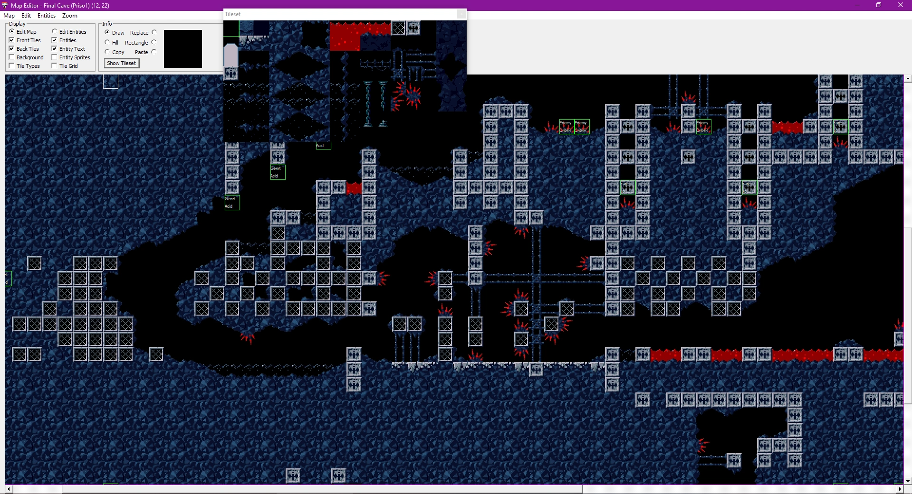

# Cave Editor	

<fieldset>
<legend>Cave Editor:</legend>

<table><tbody>

<tr><td>Creator(s):</td><td>Wistil</td></tr>
<tr><td>Year:</td><td>2006</td></tr>
<tr><td>Platform:</td><td>Windows</td></tr>
<tr><td>Status:</td><td>

Abandoned

</td></tr>
<tr><td>Info:</td><td><a href="https://forum.cavestory.org/threads/caveeditor-again-beta-maybe-alpha.611/">Original Forum Thread</a></td></tr>

</tbody></table>
</fieldset>

 

> *"Whoa. I like this. In fact, I think you may be giving Sue's Workshop a run for its money."* 
      - Xaser, 2007

**Cave Editor** is a Cave Story editor created by **Wistil.** The editor was first unveiled in 2006 and was abandoned in 2010, thus making it abandonware. Unlike the rest of the legacy modding tools, Cave Editor is entirely stable, additionally supporting external custom resource hacking. 

A view of Cave Editor's map editing interface, alongside the tile sheet display are entities and several settings to toggle background, tile, and entity visibility.

## How to use Cave Editor

Despite having a "help" section, the editor unfortunately doesn't come with contents to help explain the editor's functions or assets.

To start, it should be noted Cave Editor has several menus that, unlike it's counterpart editor Booster Lab, are all program windows not attached to each other. For example, you can open the program and be met with the main interface. From there you can open the map editing interface, and then the script interface one layer deeper if you so desire. It is capable of opening the script menu from the main interface but entities will not be tracked properly, it is best advised to open the map interface before opening the script interface if one wishes to most effectively write events and commands. 

here are several key features to Cave Editor: 
The Main Menu Interface, which includes:
- Maps
- Tile Sets
- Sprite Sets
- Backgrounds
- Scripts
- Game Settings
- NPC Table
- The Data dropdown
- The Options dropdown

The Map Editor Interface

The Script Editor Interface

(more on these later in their respective sections)

![Cave Editor All 3 Interfaces]

## The Main Menu Interface

[Download](http://www.cavestory.org/downloads/CaveEditor0.99d.zip) (Version 0.99d).

[Download Source Code](http://www.cavestory.org/downloads/CaveEditorSource0.98e.zip).

[Forum Thread Link](https://forum.cavestory.org/threads/caveeditor-again-beta-maybe-alpha.611/)

## Trivia

- Cave Editor once had a display issue that made Wistil have to make an entirely new program to figure it out[^1]. Eventually, the issue was fixed[^2].

[^1] https://forum.cavestory.org/threads/cave-editor-display-problem.1726/
[^2] https://forum.cavestory.org/threads/caveeditor-again-beta-maybe-alpha.611/post-19898
