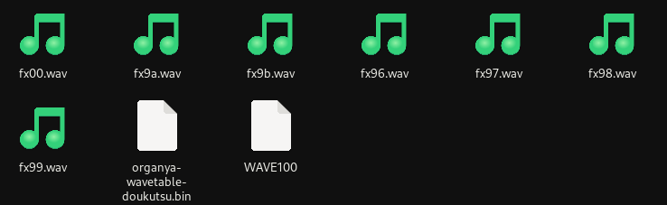

# doukutsu-rs

<fieldset>
<legend>d-rs:</legend>

<table><tbody>

<tr><td>Creator(s):</td><td>Alula Et al.</td></tr>
<tr><td>Year:</td><td>2021</td></tr>
<tr><td>Platform:</td><td>Mac, Linux, Windows, Android</td></tr>
<tr><td>Status:</td><td>

Active development

</td></tr>
<tr><td>Website:</td><td><a href="https://doukutsu-rs.github.io/">Official website</a></td></tr>

</tbody></table>
</fieldset>

**Doukutsu-rs**, *(commonly referred to as **d-rs**)*, is an open-source recreation of Cave Story written in the Rust programming language.

The earliest mention of this engine was on August 5, 2020 in the CSMC discord server. On [August 18, 2020](https://github.com/doukutsu-rs/doukutsu-rs/commit/b89d54251f42f4d8b247bbc6ebac2c9efe78ac74), the first commit was uploaded to Github.

Since this engine is still in active development, there is still no "Official" release of the engine, though nightly builds with the latest changes are available on the official website.

## Behavior

d-rs is designed to be a drop-in replacement for all existing versions of cave story, including:
- [Cave Story Freeware](freeware)
- [Cave Story +](cavestoryplus-pc)
- Cave Story Switch
- [CSE2](cse2)
- [NXEngine](nx-engine)

D-rs will alter its behavior to closely mimic these engines, depending on which one it is supposed to replace. For example, it will adopt fancy water when coupled with the Nintendo Switch port, or animated facepics with the NXEngine files. The engine also supports 2 player multiplayer analogous to CS-Switch.

D-rs also has support for pxpack mapfiles, similar to those used in Pixel's newer games like Kero Blaster. Pxpack uses 8x8 tiles and has multiple layers.

### Lighting
D-rs also has a custom lighting engine that implements basic raycasting and colored point lights. This can be enabled or disabled during gameplay, but is overridden by some of the other ports' files (an example of this being CS-Switch).

### Data
To avoid legal issues, d-rs does not ship with any cave story assets, and must be placed in a pre-existing install folder. If placed with vanilla Cave Story, it will automatically extract all embedded assets into the `./data` subdirectory.

The engine supports the following stage formats in priority order[^1]:
1. stage.tbl
2. stage.sect[^2]
3. mrmap.bin
4. stage.dat

D-rs hard-bakes some assets into the executable at compile-time, but all internal assets can be replaced by putting their replacements in the `./data/builtin` folder next to the final executable.
Things that can be replaced in this manner include:
- Localizations
- Fonts
- ORG soundfonts
- Controller mappings
- Screen buttons *(mobile devices only)*
- Crabby-Sue Headbands *(See: [Mascot](#mascot))*
- Lightmaps

[^1]: *Stage tables with higher priority will be loaded in lieu of lower ones, even if multiple share the same directory.*
[^2]: *This is a custom map format created by d-rs when it extracts freeware assets. It represents a raw chunk of memory taken from the executable where the vanilla maps are stored.*

### Sound
The engine supports all formats of [.org](organya) as well as .ogg soundtracks. The formats it plays can be selected in the same manner as with Cave Story+.

To create the sound database for the .ORG engine, The backend uses a `.bin` format that combines the `wav100.bin` file with the `wav` samples of the drums into a single file.[^3]

[^3]: *(note: wave100 is named thus because it contains 100 instruments with 256 samples each)*

This file is hard-baked into the executable at compile time, but can be replaced by naming the new file `organya-wavetable-doukutsu.bin` and placing it in `./data/builtin` in the final game directory.

In the words of the developer:
>...and the format is wave100.bin + wav files with drums concatenated

>

>This is how it was created:
`cat WAVE100 fx96.wav fx97.wav fx98.wav fx99.wav fx9a.wav fx9b.wav fx00.wav fx00.wav > organya-wavetable-doukutsu.bin` .

>On windows, it's `copy WAVE100 + fx96.wav + fx97.wav + fx98.wav + fx99.wav + fx9a.wav + fx9b.wav + fx00.wav + fx00.wav organya-wavetable-doukutsu.bin`

A pre-made version of the full org3 wavetable can be found here *(note: this file now ships with all source copies of d-rs, it just needs to be re-named and placed in the proper folder)*: [organya-wavetable-orgmaker.bin](files/organya-wavetable-orgmaker.bin)

If the org file is `org-02` or `org-01`, the game will ignore the instruments chosen for drums and hard-index them based on track number, just like CS-Freeware. If the org file is `org-03`, the instrument variable will be used to select the correct sample. This means that dropping a new soundfont file into the game may produce the wrong drum sounds unless the header of each ORG is changed to `org-03` or `org-02` accordingly. The simplest way to do that is to use a [HEX editor](https://mh-nexus.de/en/hxd/) to edit the header. [ORGMaker](orgmaker3) can also be used to do this by editing the drum instruments and re-saving.

This method is different from Cave Story Vanilla and CSE2. Both of those versions render the drums from `.pxt` (pixtone) files, not `.wav`. This makes using org3 formatted soundtracks with these players much more difficult, and requires (in the case of CSE2) re-writing part of the ORG backend to handle `.wav` samples like d-rs *(This is possible, and has been done multiple times by various CS modders)*.

## Debugger Functions
This engine has a built-in debugger. Debug functions can be accessed by pressing the following function keys:

- **F3**: Godmode
- **F4**: Infinite Booster
- **F5**: Toggle subpixel scrolling
- **F6**: Toggle motion interpolation
- **F8**: Reduce game speed by 10%
- **F9**: Increase game speed by 10%
- **F10**: Show NPC debug points, Red dot on NPC's origin, white dots on currently colliding tiles
- **F11**: Show Average FPS and TPS
- **F12**: Show debug window
- **`**: Toggle Command line
- **Ctrl + F3**: Reload Sound Manager
- **Ctrl + S**: Quick Save

The F12 debug window contains more, in depth functions, such as arbitrary TSC execution, map jumping, noclip, and others.

## Scripting
From the earliest versions, doukutsu-rs had support for lua scripting, which allowed to make some engine and behavior modifications without needing to recompile the source code. However, this feature was completely removed in version **0.101.0-beta6**. 

## Mascot

Since conception, d-rs has used Sue in some form as its mascot, per developer preference. As the port aged into a complete game, a custom version of Sue was made to go along with it by user Daedliy. The mascot was tinted blue and given various crab-like features in order to relate back to Rust's mainstream mascot, [Ferris](https://rustacean.net/).

In order to celebrate the engine's rust heritage, every year on July 7, all in-game instances of Sue will become "crabby", taking on the color and crab features of the engine's mascot. This feature can also be enabled manually using the "more rust" option in the debug menu.

