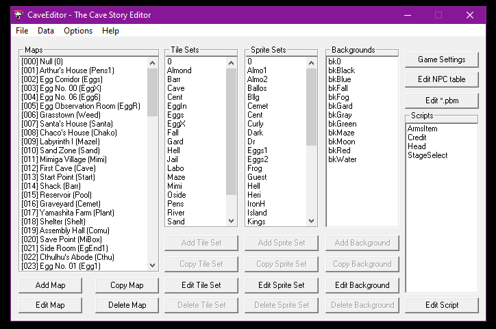

<fieldset>
<legend>Cave Editor:</legend>

| Creator: | Wistil |
| Year: | 2006 |
| Status: | Stable but I'm adding more text here to test the max size constraints |
</fieldset>

# Syntax Testing Page
That title above used Header One. Whatever header text is at the top of a page becomes the page title in the wiki system.

## Header Two
This page is mainly for just checking what works in the wiki itself. This page is a somewhat terrible tutorial.

Especially when we change the theme of the site, this page can serve to check how everything looks.

### Header Three
For actual tutorials use this link to [basic syntax](https://docs.github.com/en/get-started/writing-on-github/getting-started-with-writing-and-formatting-on-github/basic-writing-and-formatting-syntax) and to [advanced syntax](https://docs.github.com/en/get-started/writing-on-github/working-with-advanced-formatting).

#### Header Four (Avoid using this one)
Header four doesn't get added to the auto-generated table of contents at the top of the page. There is no such thing as header five.

***

### Adding Images
First, add the image(s) to [this img folder](https://github.com/CaveStoryModdingCommunity/modding-wiki/tree/master/wiki/img) using the button on the top right.

Then you can format it like so: ``


Note: do not add a `/` before "img", otherwise it'll try loading from a folder that isn't there.

***

This is a link to a page that exists: [Cave Editor](cave-editor)

This is a link to a page that does not: [Cave Story 2: Reverence](cave-story-2-reverence)

As you can see it's identical, so one could link to pages that should exist but don't yet.

You can also link to specific headers of an article, whether it be in the same page or another page. Just substitute dashes for spaces:

[How do you add images to this wiki?](example-page#adding-images)

If you want to just have the actual full URL display, wrap it up in `<>` angle-brackets:

<https://cavestory.org/>

***

*Italics* uses single asterisks `*`.

**Bold** uses double asterisks.

***Bold Italics*** uses triple asterisks. Do note that triple asterisks on their own line creates a horizontal line divider instead (demonstrated throughout this page).

The above three can also be denoted using single, double, or triple underscores `_`, however to keep things consistent we'll keep it to asterisks.

~~Strikethrough~~ uses double tilde's `~~`.

Text with <sub>subscript.</sub> Text with <sup>superscript.</sup>

Oh hey, it's three asterisks are on their own line creating a Horizontal Line:

***

```
You can create blocks of text by enclosing it in triple backticks.
Add the backticks on the lines above and below the text you want in a box.
Unlike normal text, you don't need to use double newlines to create a new line.
```

You can also have `inline code` by using single backticks on the same line with text.

	Blocks of text are also created from indenting (using TAB or four spaces)
    However it looks kind of confusing when later editing the file.
    So don't do it like this. Please use backticks.

This is different from a quote, which uses a Right-Angle bracket.
> This is what 
> a quote looks like.
>
> However, like normal body text you have to use double newlines to go to the next line.

***

<figure>
  
  <figcaption>Cave Editor's Main Menu with really really long text supcalifragilshutup</figcaption>
</figure>

Unordered lists can be created using dashes `-`:
- This is a list item.
- Hooray!

They are also created by using `+` or `*`, but for consistency we'll stick with dashes.

To create an ordered list, you can use a number followed by a period:

1. First item.
2. Second item.
3. Third item.

(The number doesn't technically actually matter, you can repeat them or use random numbers, but for neatness please keep them in order as they should be displayed.)

You can also nest your lists by DOUBLE indenting them:
1. Which means that...
    1. ...they stagger like this...
    2. ...with each indent...
        - ...like so on...
    3. ...like so on...
        - ...and so on.

Just remember to use DOUBLE INDENTS, not single indents.

***

You can also create tasklists using `[ ]` and `[x]`.
[ ] We need to do a thing
[x] But we did the other thing.
[ ] \(But to have parenthesis, it needs to be escaped using backslash (explained later)).

I don't know if we'll ever need to use this. Maybe to compare the features of editors?

***

Emotes can be denoted using colons, so `:thumbsup:` is :thumbsup:. Usability is questionable.

***

To use the first footnote, use `[^1]` at the end of a word[^1].
```
[^1]: You can then write the footnote right below on the next line (to keep it together) just like this. It'll automatically display at the bottom.
```
[^1]: You can then write the footnote right below on the next line (to keep it together). It'll automatically display at the bottom.

Obviously you want to increase the number with each footnote[^2], and also note they only support single lines. You CANNOT add multiple lines to them.
[^2]: This is the 2nd footnote. There can only be one line in a footnote.

***

| Header Row | Separated by hyphens (at least three) |
| --- | --- |
| Cells of any size. | Pipes separate columns. |
| Just keep the column... | ...number consistent. |

| But what about... | ...aligning... | ...the cells? |
| :--- | :---: | ---: |
| Left Aligned | Center Aligned | Right Aligned |
| Just! | Add! | Colons! |

***

Collapsed section test using `<details>` tag:
<details><summary>Hey guess what? (Click this piece of text)</summary>
You're stinky! :poop:
</details>


***

To escape a character (that normally does formatting stuff) you can use a backslash before the character:
- `\*` becomes `*`. Probably the only one that's actually useful in case you needed to use it to represent multiplication.
- `\[text\]` becomes `[text]`, instead of becoming a hyperlink.
- You can even use `\\` to add a `\` backslash, if for some reason you needed to do that.
- Since code blocks don't accept formatting, you don't need to escape characters in them (like the three lines above).
- While Left Angle-Brackets usually denote html tags, as long as you don't close them it's actually fine. You can safely talk about TSC commands such as <CAT <MSG and <END without issues!

***

### Things that don't work
There are various features that work on Github's version of markdown but not when compiled onto Jekyll-based static sites (what this wiki is). Enlight is however keeping these tests here in case a theme update/change ends up enabling them. The rest of you can ignore everything below.

***

> [!NOTE]
> Highlights information that users should take into account, even when skimming.

> [!IMPORTANT]
> Crucial information necessary for users to succeed.

> [!WARNING]
> Critical content demanding immediate user attention due to potential risks.

***


***

$`\sqrt{3x-1}+(1+x)^2`$

```math
\left( \sum_{k=1}^n a_k b_k \right)^2 \leq \left( \sum_{k=1}^n a_k^2 \right) \left( \sum_{k=1}^n b_k^2 \right)
```

***


