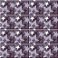
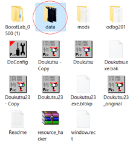
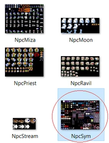
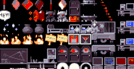
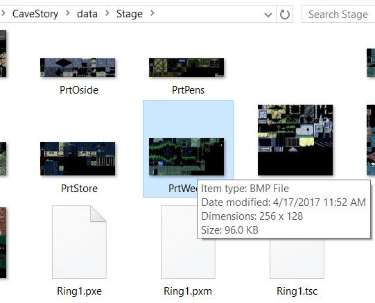
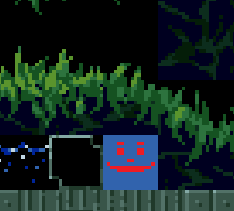
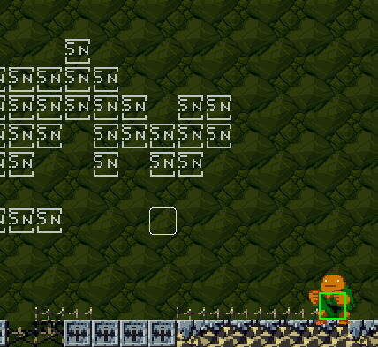

# "Diversifying" Breakable Blocks

This special little trick allows you to diversify the styles of the "breakable blocks" in Cave Story. It's fairly simple to get this to work, as it only takes a couple minutes to do.

First, go into the "data" folder in your Cave Story directory.

Then, enter the "Npc" folder. Select "npcSym" and edit it.

Now, find the breakable block in the npcSym spritesheet and get rid of it entirely. By default, the breakable block looks like a low saturated purple block with a mysterious star-like pattern.

Once that's done, any breakable tile that spawns in the map in-game will have the "Sn" tile from the stage tilesets.

Go ahead and edit a stage tileset located in the "Stage" folder in "Data".

Then, replace those "Sn" tiles with your own tileset exclusive breakable block sprite! You can have as many as you want, and there are no limitations to how you want to customize your breakable block sprites.

Have fun!

## What do the "Sn" tiles do?

The "Sn" tiles in the stage tilesets signify that those tiles will render as a breakable block, spawning and overlapping the "Sn" tile with the breakable block sprite. However, the "Sn" tiles are rendered and visible underneath.

However, you can make any tile render as a breakable block in your tileset. In [Booster's Lab](boosters-lab), simply right-click a tile in your tile selector and set the element to the breakable block element.

*Refer to the Tilesets and Tile Properties article for more information on how these elements work.*

## Applying backdrop tiles to your Breakable Blocks

One tile to the LEFT of every breakable block/"Sn" tile in your stage tilesets are designed to be the "backdrops" of your breakable blocks, so when they are shot, they will spawn whatever is underneath them from the stage tileset.

Be sure to have any foreground or background tile element applied to these tiles, unless if you want solid tiles (or even spikes) to appear after breaking these blocks!

## Durable Breakable Blocks

Breakable blocks that take more than one hit to destroy can be achieved through placing sn tiles in a horizontal line on the tileset, this could potentially allow for tiles that "crack" upon being shot at, that would then break afterwards. This functions in line with the above section as it explains that when a breakable block is broken, it immediately turns into the tile one space to the left on the tileset.