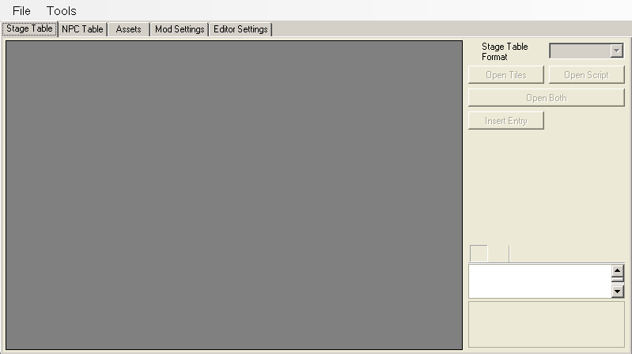

# The King's Table

> *"evil brayconn be like 'hey everyone check out my editor BEANS'"* - Eli, refrencing an in-joke about the program's placeholder icon

**The King's Table** (most commonly abbreviated as 'TKT') is an in-progress editor being developed by **Brayconn**.

The program, written in .net c#, aims to be as universal as possible when it comes to the world of Cave Story Modding, and attempts to be compatable with everything that came before it as well as everything that may come after it. At the time of writing, the editor is still a heavy work-in-progress, and is not extremely usable in its current state.

[Download / Source](https://github.com/Brayconn/TheKingsTable)
